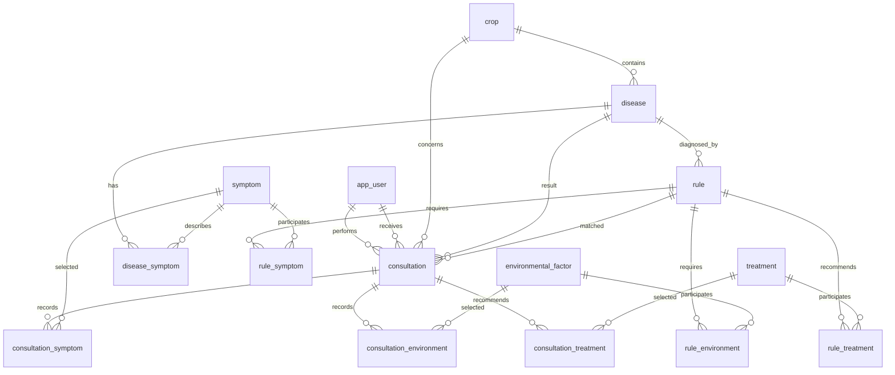

# Tomato Disease Expert System

A database-driven expert system for diagnosing tomato plant diseases from manually selected symptoms or symptoms extracted from an uploaded image by Google Gemini. The application is built with Streamlit and PostgreSQL.

Gemini is not the diagnostic authority. It only observes an uploaded tomato image and extracts visible symptoms. Every diagnosis then runs two independent methods: the expert-rule inference engine and a knowledge-base-derived Naive Bayes predictor. Both raw results are stored and displayed, with an agreement indicator; treatments remain rule-derived.

## Table of contents

1. [Project objectives](#project-objectives)
2. [Scope and core principles](#scope-and-core-principles)
3. [Users and application pages](#users-and-application-pages)
4. [Diagnosis workflows](#diagnosis-workflows)
5. [Expert-system reasoning](#expert-system-reasoning)
6. [AI prediction and hybrid diagnosis](#ai-prediction-and-hybrid-diagnosis)
7. [Image recognition with Gemini](#image-recognition-with-gemini)
8. [System architecture](#system-architecture)
9. [Database design](#database-design)
10. [Entity-relationship diagram](#entity-relationship-diagram)
11. [Normalization decisions](#normalization-decisions)
12. [Database consolidation](#database-consolidation)
13. [History and PDF reports](#history-and-pdf-reports)
14. [Authentication and authorization](#authentication-and-authorization)
15. [User-interface decisions](#user-interface-decisions)
16. [Installation and configuration](#installation-and-configuration)
17. [Running and testing](#running-and-testing)
18. [Project structure](#project-structure)
19. [Known limitations and safeguards](#known-limitations-and-safeguards)
20. [Future improvements](#future-improvements)

## Project objectives

The project demonstrates a practical crop-disease expert system that can:

- maintain tomato diseases, symptoms, treatments, environmental factors, and diagnostic rules in a relational database;
- allow farmers to perform their own diagnoses;
- allow experts to perform general diagnoses or diagnoses for registered farmers;
- use Gemini Vision to extract visible symptoms from tomato images;
- run a transparent rule-based diagnosis and an independent Naive Bayes disease prediction for the same evidence;
- explain which rule and evidence produced the diagnosis;
- preserve consultation history;
- generate editable, on-demand PDF reports;
- provide database-backed administration of experts, farmers, diseases, symptoms, treatments, and rules.

## Scope and core principles

### Current scope

- The crop is currently restricted to tomato plants.
- Manual diagnosis uses selected symptoms and optional environmental factors.
- Image diagnosis accepts image files and uses Gemini to identify visible symptoms.
- The PostgreSQL rule base produces the rule-based diagnosis and treatment list.
- A runtime Naive Bayes model independently predicts a disease from the same evidence.
- Both farmers and experts have database-backed accounts.

### Core principles

- No disease, symptom, treatment, environmental factor, user, or expert rule is hardcoded into the UI.
- Gemini never directly selects either stored disease result.
- Uploaded image bytes are processed in memory and are not stored in PostgreSQL.
- Knowledge relationships use normalized junction tables rather than arrays, CSV values, or JSON columns.
- One `consultation` row represents one diagnosis event.
- Reports are generated from consultation data and are not stored as separate report records.
- The database contains only the 15 current application tables and no migration-tracking table.

### Features intentionally outside the current scope

- diagnosis of crops other than tomato;
- a trained local image-classification model;
- persistent image storage;
- automatic weather-station integration;
- medication purchasing or treatment scheduling;
- settings, about, and AI model-management pages.

## Users and application pages

### Expert access

Experts and administrators have access to:

| Page | Responsibility |
|---|---|
| Dashboard | Statistics, disease frequency, and recent consultations |
| Diagnosis | General diagnosis or diagnosis for a selected farmer |
| History | Search, filter, review, edit report text, and export consultations |
| Image Recognition | Upload a tomato image, extract symptoms, and run rule diagnosis |
| Experts | View and add database-backed expert accounts |
| Farmers | View farmer cards, edit farmers, and add farmer accounts |
| Diseases | View disease cards and maintain disease knowledge |
| Symptoms | View symptom cards, edit symptoms, and add symptoms |
| Treatments | View treatment cards, edit treatments, and add treatments |
| Expert Rules | View, edit, and create diagnostic rules with confidence values |

The navigation group is labelled `Expert-only`. Administrators are treated as expert-capable users for compatibility with the seeded system-administrator account.

### Farmer access

Farmers have access to:

| Page | Responsibility |
|---|---|
| Dashboard | Personal statistics and recent diagnosis activity |
| Diagnosis | Self-service manual diagnosis |
| History | The farmer's own consultation history and PDF export |
| Image Recognition | Self-service image-assisted diagnosis |

A farmer does not choose between a general and personal diagnosis. A farmer diagnosis is always stored against that farmer's own `app_user` record.

## Diagnosis workflows

### Manual diagnosis

1. The user selects symptoms from the database.
2. The user may select environmental factors such as humidity, temperature, rainfall, soil moisture, or plant spacing.
3. The service loads all active rules for the tomato crop.
4. The inference engine compares the selected database IDs with each rule's required evidence.
5. The best rule determines the disease and base confidence.
6. Treatments linked to the matched rule are returned.
7. The consultation, selected evidence, matched evidence, result, explanation, and treatments are stored.

### Image-assisted diagnosis

1. The user uploads an image file.
2. The application validates and reads the image in memory.
3. Gemini analyzes only the visible tomato-plant evidence.
4. Gemini returns structured symptom names, scores, and a visual summary.
5. The returned names are mapped to existing `symptom` rows.
6. The mapped symptom IDs are sent to the same inference engine used by manual diagnosis.
7. The final rule-based result is stored with source `IMAGE`.
8. The Gemini extraction text is retained on the consultation for traceability; the image itself is not retained.

### Consultation types

| Type | Meaning |
|---|---|
| `FARMER_SELF` | Farmer manual self-diagnosis |
| `ADMIN_FOR_FARMER` | Expert manual diagnosis for a selected farmer |
| `ADMIN_GENERAL` | Expert general or test manual diagnosis |
| `IMAGE_FARMER_SELF` | Farmer image-assisted self-diagnosis |
| `IMAGE_ADMIN_FOR_FARMER` | Expert image-assisted diagnosis for a farmer |
| `IMAGE_ADMIN_GENERAL` | Expert general or test image diagnosis |

## Expert-system reasoning

### Knowledge facts versus diagnostic rules

`disease_symptom` describes symptoms known to occur with a disease. It supports disease information and knowledge-base presentation, but it does not fire a diagnosis.

The inference engine uses only:

- `rule`;
- `rule_symptom`;
- `rule_environment`;
- `rule_treatment`.

This distinction matters because a disease may commonly have several symptoms while a particular diagnostic rule may require only a specific combination.

Example:

```text
Disease knowledge:
Early Blight can have brown spots, yellow leaves, and leaf drop.

Diagnostic rule:
IF brown spots AND yellow leaves AND high humidity
THEN Early Blight with confidence 85%.
```

### Rule matching

For each active rule:

```text
match ratio = matched required facts / total required facts
matched score = integer(match ratio * rule confidence score)
```

- A complete match receives tier `HIGH`.
- A partial match at or above 50% can receive tier `LOW`.
- If no rule reaches 50%, the engine can still return the best non-zero partial match as `LOW`.
- Rules with no matched symptom or environmental factor are not candidates.
- Results are sorted by match tier and matched score.
- The highest-ranked rule becomes `matched_rule_id` on the consultation.

The displayed final confidence is calculated by the confidence calculator from the available rule matches. The stored explanation uses the disease explanation template when available and otherwise names the matched expert rule.

### Explainability

The system stores and displays:

- the selected disease;
- final confidence;
- match tier;
- matched rule;
- matched symptoms;
- matched environmental factors;
- explanation text;
- recommended treatments.

This makes the result traceable to database evidence rather than an unexplained AI prediction.

## AI prediction and hybrid diagnosis

### Phase 6: Naive Bayes AI prediction

`app/expert_system/ai_predictor.py` provides a model-like `NaiveBayesPredictor` with model version `naive_bayes_v1` and a `predict(symptom_ids, environmental_factor_ids, crop_id)` method.

This is actual Naive Bayes computation, but it is not an offline model fitted to a separate historical training dataset. At prediction time, the component derives:

- disease priors from the total knowledge evidence associated with each disease;
- symptom likelihoods from `disease_symptom.weight` plus one observation for each active `rule_symptom` relationship;
- environmental-factor likelihoods from active `rule_environment` relationships;
- unseen-event probabilities through Laplace smoothing with alpha 1.

For each disease, the implementation computes in log space:

```text
log score(disease) = log P(disease)
                   + sum(log P(selected symptom | disease))
                   + sum(log P(selected environmental factor | disease))
```

The log scores are converted with a numerically stable softmax and normalized across every disease for the crop. The disease with the largest posterior probability becomes the AI prediction, and its normalized probability is rounded to an integer percentage. No AI result is produced when no symptom is supplied.

This approach is knowledge-base-derived rather than historically fitted. It must not be described as using a held-out training split, and it does not establish real-world classification accuracy by itself.

### Phase 7: hybrid expert system

Every manual or image-assisted diagnosis sends the same symptom and environmental-factor IDs to two independent paths:

1. **Rule-Based Result**: existing expert-rule inference, matched rule, explanation, confidence, and treatments.
2. **AI Prediction (Naive Bayes)**: independently normalized disease probability from the live knowledge base.

The UI shows both results side by side. It never replaces them with a merged confidence. A separate indicator states whether both methods selected the same disease.

The consultation stores the rule result in the existing `final_disease_id`, `final_confidence`, `matched_rule_id`, and `explanation` columns. The AI result is stored in:

- `ai_predicted_disease_id`;
- `ai_confidence`;
- `ai_model_version`.

If no expert rule matches but Naive Bayes returns a prediction, the consultation is still retained with match tier `NONE`, an empty rule result, and the independent AI result. Proposed treatments remain empty because treatments are intentionally tied to expert rules, not inferred by Naive Bayes.

### Phase 9 evaluation boundary

`scripts/evaluate_hybrid.py` reports the actual agreement rate among stored consultations that contain both a rule-based disease and an AI-predicted disease. It reports eligible consultations, agreements, disagreements, and agreement percentage.

Agreement is not accuracy. The project currently has no independent ground-truth labels or held-out historical dataset, so it does not claim accuracy, precision, recall, F1, or generalization performance. Existing consultations created before the AI columns are excluded until they have both results. A future evaluation can compare both methods with expert-confirmed or laboratory-confirmed outcomes.

## Image recognition with Gemini

### Gemini's responsibility

Gemini performs symptom extraction only. It should identify visible evidence such as leaf spots, discoloration, curling, wilting, powdery coating, lesions, stunting, or fruit damage.

Gemini must not create new database symptoms, rules, diseases, or treatments. Unknown observations can be included in the visual summary, but only symptoms mapped to existing database IDs enter the rule engine.

### Configuration

```env
GEMINI_API_KEY=your_gemini_api_key_here
GEMINI_MODEL=gemini-2.0-flash
```

The model can be changed through `GEMINI_MODEL`. The API key must remain in `.env` and must not be committed.

### Image safeguards

- The upload control accepts images.
- Uploaded bytes are sent for analysis and are not persisted.
- A failed or unconfigured Gemini request should not silently become a final disease diagnosis.
- The final result remains limited to the diseases and rules defined in PostgreSQL.

## System architecture

```text
Streamlit UI
    |
    v
Service layer
    |-- DiagnosisService
    |-- ImageRecognitionService
    |-- ConsultationService
    |-- PdfService
    |
    v
Inference engine and repositories
    |-- RuleMatcher
    |-- Confidence calculator
    |-- Explanation builder
    |-- PostgreSQL repositories
    |
    v
PostgreSQL 15-table knowledge base and consultation store

Image path only:
Uploaded image -> Gemini symptom extraction -> database symptom mapping
               -> same inference engine -> consultation result
```

### Application layers

| Layer | Responsibility |
|---|---|
| `app/ui` | Streamlit navigation, forms, cards, filters, history, and export workflow |
| `app/services` | Coordinates diagnosis, image recognition, consultations, and PDFs |
| `app/expert_system` | Builds rules, scores matches, chooses a result, and creates explanations |
| `app/repositories` | Executes SQL against the consolidated schema |
| `app/ai` | Connects to Gemini and validates structured symptom extraction |
| `database` | Canonical schema, retained seed data, and legacy consolidation script |

## Database design

### Final table inventory

The production database contains exactly 15 public application tables.

| Group | Tables |
|---|---|
| Users | `app_user` |
| Knowledge base | `crop`, `disease`, `symptom`, `treatment`, `environmental_factor`, `disease_symptom` |
| Expert rules | `rule`, `rule_symptom`, `rule_environment`, `rule_treatment` |
| Consultations | `consultation`, `consultation_symptom`, `consultation_environment`, `consultation_treatment` |

### Table responsibilities

| Table | Purpose |
|---|---|
| `app_user` | Login credentials, role, status, name, and farmer contact/profile fields |
| `crop` | Supported crop records; currently tomato |
| `disease` | Tomato diseases and explanation templates |
| `symptom` | Reusable observable symptom definitions |
| `treatment` | Reusable treatment recommendations |
| `environmental_factor` | Category/value pairs such as `Humidity: High` |
| `disease_symptom` | Descriptive disease-to-symptom knowledge |
| `rule` | Disease-linked expert rule name and confidence |
| `rule_symptom` | Symptoms required by a rule |
| `rule_environment` | Environmental factors required by a rule |
| `rule_treatment` | Prioritized treatments produced by a rule |
| `consultation` | One diagnosis event and its final result |
| `consultation_symptom` | Submitted symptoms and whether the selected rule matched them |
| `consultation_environment` | Submitted environmental factors and match status |
| `consultation_treatment` | Treatments recommended for the consultation |

### Important consultation columns

- `performed_by_user_id`: account that performed the diagnosis;
- `farmer_id`: optional farmer receiving the diagnosis;
- `crop_id`: diagnosed crop;
- `final_disease_id`: rule-based selected disease;
- `final_confidence`: rule-based percentage from 0 to 100;
- `ai_predicted_disease_id`: independently predicted Naive Bayes disease;
- `ai_confidence`: normalized Naive Bayes probability from 0 to 100;
- `ai_model_version`: predictor version such as `naive_bayes_v1`;
- `matched_rule_id`: rule responsible for the diagnosis;
- `explanation`: stored human-readable reason;
- `source`: `SYMPTOMS` or `IMAGE`;
- `consultation_type`: actor and workflow classification;
- `match_tier`: `HIGH`, `LOW`, or `NONE`;
- `gemini_raw_extraction`: image-analysis trace text when applicable.

### Role and integrity constraints

- `app_user.role` is `ADMIN`, `EXPERT`, or `FARMER`.
- Administrators must have a username and password hash.
- Consultation confidence must be between 0 and 100.
- Consultation source, type, and match tier are database-constrained.
- Foreign keys protect rule, evidence, treatment, crop, disease, and user references.
- Junction tables prevent duplicate relationships with unique constraints.

## Entity-relationship diagram



## Normalization decisions

### Why rule tables were not merged

A single rule may require many symptoms, require many environmental factors, and recommend many treatments. Merging `rule`, `rule_symptom`, `rule_environment`, and `rule_treatment` into one table would require either:

- array, CSV, or JSON values in a column, which violates the project's normalization rule; or
- repeating the rule name, disease, and confidence for every symptom/factor/treatment combination, which creates redundant rows and update anomalies.

These four tables represent genuine one-to-many and many-to-many relationships and are the normalized structural minimum for rule-based knowledge.

### Why consultation tables were not merged

One consultation can contain many symptoms, many environmental factors, and many treatments. Combining `consultation`, `consultation_symptom`, `consultation_environment`, and `consultation_treatment` would create the same array/JSON problem or duplicate the consultation result across many rows.

Keeping one row per diagnosis event is necessary for dashboards, history, filtering, explanation, and report generation.

### Why disease facts and rules remain distinct

`disease_symptom` answers, "What symptoms are associated with this disease?"

`rule_symptom` and `rule_environment` answer, "What exact evidence is required for this diagnostic rule?"

Using disease facts directly as rule requirements would make every associated symptom mandatory and would prevent experts from defining alternative diagnostic patterns for the same disease.

### Why reports are not stored

A report is a presentation of consultation data, not an independent diagnosis record. Persisting report copies creates stale duplicated data when knowledge or display wording changes. Reports are therefore built on demand from the consultation and its junction tables, with editable temporary text before download.

### Why images are not stored

The system needs extracted symptoms and trace text, not permanent image storage. Avoiding stored image bytes reduces privacy, storage, backup, and database-size concerns.

## Database consolidation

### Migration summary

On 2026-06-22, the live schema was consolidated from 29 tables to 15 tables.

The migration:

- folded `role` into `app_user.role`;
- folded farmer profiles into `app_user`;
- merged environmental condition/category and value tables into `environmental_factor`;
- folded diagnosis result, matched rule, and explanation data into `consultation`;
- retained matched symptom and environmental evidence on consultation junction tables;
- removed persisted reports and image metadata;
- removed the unused legacy classifier prediction table;
- removed redundant disease environment and disease treatment tables;
- removed obsolete migration, query, and fragmented seed folders;
- retained one canonical `schema.sql`, one `seed.sql`, and the reviewed consolidation SQL.

### Verified retained row counts

| Table | Before | After |
|---|---:|---:|
| `app_user` | 4 | 4 |
| `consultation` | 4 | 4 |
| `consultation_environment` | 5 | 5 |
| `consultation_symptom` | 30 | 30 |
| `consultation_treatment` | 8 | 8 |
| `crop` | 1 | 1 |
| `disease` | 8 | 8 |
| `disease_symptom` | 23 | 23 |
| `environmental_factor` | 15 source pairs | 15 |
| `rule` | 13 | 13 |
| `rule_environment` | 14 | 14 |
| `rule_symptom` | 20 | 20 |
| `rule_treatment` | 19 | 19 |
| `symptom` | 12 | 12 |
| `treatment` | 10 | 10 |

Four role values, two farmer profiles, four diagnosis results, four matched rules, four explanations, and eight matched symptom records were migrated forward.

### Approved data loss

The destructive migration was explicitly approved. Six `disease_environment` relationships and six `disease_treatment` relationships not represented by expert rules were dropped. The removed AI prediction, report, and image tables did not contain independent data requiring retention.

### Backup and rollback

The pre-consolidation development backup was created at:

```text
C:\tmp\crop_expert_pre_consolidation.dump
```

Because the old schema cannot be reconstructed losslessly from the consolidated schema, rollback requires restoring a pre-migration PostgreSQL dump. The consolidation script is transactional, so a failure before its commit restores the original schema automatically.

### Canonical SQL files

| File | Purpose |
|---|---|
| `database/schema.sql` | Exact current 15-table schema |
| `database/seed.sql` | Current knowledge base, demo accounts, and retained consultation data |
| `database/consolidate_29_to_15.sql` | One-time legacy 29-to-15-table migration |
| `database/add_naive_bayes_columns.sql` | Additive Phase 6/7 consultation columns |

## History and PDF reports

History shows every consultation matching the active filters. Experts see all consultations by default and can restrict the view to a particular farmer; farmers only see consultations associated with their own account. The source filter continues to support all, manual, and image diagnoses.

The history table is read-only and has no ID column, row-selection checkboxes, or hidden selection state. It displays:

- date and farmer when applicable;
- rule-based disease and confidence;
- Naive Bayes disease and confidence;
- agreement status;
- submitted symptoms;
- diagnosis source and consultation type.

The **Export PDF** tab formats every currently filtered consultation into one large scrollable text area. The user can edit the complete report as a single formatted body before generating one PDF. When an expert filters to a farmer, only that farmer's consultations enter the editor and PDF. The report includes actor, crop, source, both independent results, model version, agreement, symptoms, rule explanation, proposed treatments, and Gemini extraction text when present.

The edited report is downloaded directly and is not inserted into a report table.

## Authentication and authorization

### Database-backed login

Login reads `app_user`; no account list is hardcoded. Passwords are stored as hashes using the application's password utility.

### Roles

| Role | Access |
|---|---|
| `ADMIN` | Expert-capable access and system-administrator account compatibility |
| `EXPERT` | Expert workspace and knowledge-base administration |
| `FARMER` | Personal dashboard, diagnosis, image recognition, and history |

Every protected page revalidates the session user against PostgreSQL and confirms that the account is active.

### Demo accounts

| Username | Password | Role |
|---|---|---|
| `admin` | `admin123` | Administrator |
| `expert` | `expert123` | Crop expert |
| `farmer1` | `farmer123` | Farmer |

These credentials are for development and demonstration. They must be changed or removed before production deployment.

## User-interface decisions

- The application opens directly into the working login/diagnosis experience rather than a marketing landing page.
- The sidebar hides on login and contains only navigation and logout after authentication.
- The login form is centered and limited to 500px.
- Management lists use white cards for scanning rather than wide raw tables.
- Add and edit workflows use separate tabs.
- The final tab is styled as the add/create action.
- Farmers, diseases, symptoms, treatments, rules, and experts are loaded from PostgreSQL.
- Confidence values are shown as percentages and tiers.
- The UI uses restrained green, white, amber, and status colors with an 8px maximum card radius.
- The dashboard recent-consultation display shows actual symptom names rather than repeating the word "symptoms".

## Installation and configuration

### Prerequisites

- Python 3.10 or newer;
- PostgreSQL;
- a Google Gemini API key for image recognition;
- PowerShell commands below, or equivalent shell commands.

### Python dependencies

Core dependencies include Streamlit, psycopg2, python-dotenv, pandas, pytest, fpdf2, Pillow, and google-genai. The authoritative list is `requirements.txt`.

### Environment variables

Copy the example file:

```powershell
Copy-Item .env.example .env
```

Configure:

```env
DB_HOST=localhost
DB_PORT=5433
DB_NAME=crop_expert_system
DB_USER=postgres
DB_PASSWORD=your_password_here
GEMINI_API_KEY=your_gemini_api_key_here
GEMINI_MODEL=gemini-2.0-flash
```

Do not commit `.env` or real API credentials.

### Install dependencies

```powershell
python -m venv .venv
.venv\Scripts\Activate.ps1
pip install -r requirements.txt
```

### Create a fresh database

```powershell
createdb crop_expert_system
psql -U postgres -d crop_expert_system -f database/schema.sql
psql -U postgres -d crop_expert_system -f database/seed.sql
```

The schema file must run before the seed file.

### Consolidate a legacy database

Back up first:

```powershell
pg_dump -U postgres -Fc crop_expert_system -f crop_expert_pre_consolidation.dump
psql -U postgres -d crop_expert_system -f database/consolidate_29_to_15.sql
```

Do not run the consolidation script against an already consolidated database.

## Running and testing

### Start the application

```powershell
python run.py
```

Or run Streamlit directly:

```powershell
python -m streamlit run app/ui/streamlit_app.py
```

### Automated tests

```powershell
python -m pytest -q
```

### Compilation check

```powershell
python -m compileall -q app scripts tests
```

### Gemini checks

```powershell
python scripts/test_gemini_connection.py
python scripts/test_gemini_vision.py
```

The vision script requires a valid API key and a suitable tomato image input according to the script's arguments.

### Verified state on 2026-06-22

- Python compilation passed.
- Twelve automated tests passed, including Naive Bayes weighting, normalization, environmental evidence, and no-symptom behavior.
- All expert and farmer Streamlit pages rendered without exceptions through Streamlit's application test harness.
- Repository queries passed against the migrated live database.
- A fresh temporary database restored successfully from `schema.sql` and `seed.sql`.
- The live database contained exactly the expected 15 tables.

## Project structure

```text
app/
  ai/                  Gemini image symptom extraction
  expert_system/       Rule construction, matching, confidence, explanations
  repositories/        PostgreSQL data access
  services/            Diagnosis, image, consultation, PDF workflows
  ui/
    components/         Shared Streamlit views and forms
    pages/admin/        Expert-capable pages
    pages/farmer/       Farmer pages
    streamlit_app.py    Authentication and navigation entry point
  config.py             Environment-backed configuration
  database.py           Connections, query helpers, schema health checks

database/
  schema.sql            Canonical 15-table PostgreSQL schema
  seed.sql              Current knowledge base and demo data
  consolidate_29_to_15.sql
                         One-time legacy schema consolidation
  add_naive_bayes_columns.sql
                         Additive Phase 6/7 consultation columns

scripts/
  evaluate_hybrid.py    Stored-consultation agreement evaluation
  test_gemini_connection.py
  test_gemini_vision.py

tests/                  Automated inference tests
run.py                  Application launcher
requirements.txt        Python dependencies
.env.example            Configuration template
README.md               Complete project documentation
```

## Known limitations and safeguards

### Limitations

- The knowledge base currently targets tomato only.
- Diagnosis quality depends on the completeness and correctness of expert rules.
- Partial matches can produce low-confidence possible diagnoses; they are not laboratory confirmation.
- Image quality, lighting, camera angle, and symptom visibility affect Gemini extraction.
- Some diseases share visual symptoms, so environmental context improves matching.
- The current password hashing utility is suitable for the project demonstration but should be reviewed against production password-hashing standards before deployment.
- PDF output uses Latin-1-compatible text replacement for unsupported characters.
- The system does not replace agricultural laboratory testing or advice from a qualified plant pathologist.

### Safeguards

- Database constraints restrict roles, confidence, source, match tier, and consultation type.
- Schema health checks require the consolidated columns, exactly 15 public tables, and an active expert account.
- Role checks protect expert and farmer pages.
- Gemini cannot introduce a disease outside the database symptom catalog.
- Naive Bayes can only select a disease already defined for the crop.
- The UI preserves rule and AI confidence separately rather than presenting a misleading merged score.
- Uploaded image bytes are not persisted.
- Reports are generated from the authoritative consultation record.
- The legacy destructive migration documents backup and rollback requirements.


## Future improvements

- Add more crops while preserving crop-specific rules and crop-specific Naive Bayes evidence.
- Add expert review and approval states for low-confidence or disagreeing diagnoses.
- Add expert-confirmed or laboratory-confirmed outcome labels for honest accuracy, precision, recall, F1, and cross-validation.
- Add audit logging for knowledge-base changes.
- Upgrade password hashing to a slow salted scheme such as Argon2 or bcrypt.
- Add automated browser regression tests and more PDF-content tests.
- Add image-size, MIME, and upload-rate limits for deployment.
- Add rule and AI-model versioning so historical consultations reference the exact knowledge version used.
- Add multilingual symptom and treatment labels.
- Add controlled weather-data integration as environmental evidence.
- Add deployment documentation, encrypted secrets management, and database backup scheduling.

## Repository

Public repository: [JIM440/cef-610-expert-system](https://github.com/JIM440/cef-610-expert-system)

This `README.md` is the single project documentation source and includes the design, architecture, schema, ERD, migration verification, operational setup, limitations, and implementation considerations.
