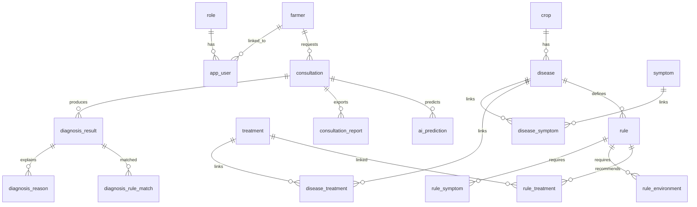

# Entity-Relationship Diagram (Final)

## Key separation

| Layer | Tables | Stores |
|-------|--------|--------|
| Disease knowledge | `disease_symptom`, `disease_environment` | Factual relationships |
| Rule knowledge | `rule_symptom`, `rule_environment`, `rule_treatment` | Diagnostic logic + treatments |
| Explanations | `diagnosis_result`, `diagnosis_reason`, `diagnosis_rule_match` | Result + traceable reasons |

## SQL script locations

| Folder | Purpose |
|--------|---------|
| `migrations/001`–`010` | Schema creation |
| `seeds/001`–`008` | Reference data + demo users |
| `queries/` | Reusable SELECT queries |
| `run_all.sql` | Full setup |
