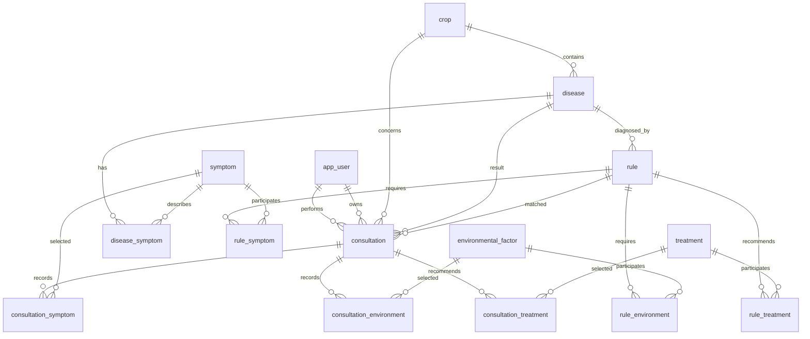

# Entity-Relationship Diagram

The production schema contains exactly 15 application tables.

## Table groups

| Group | Tables |
|---|---|
| Users | `app_user` |
| Knowledge base | `crop`, `disease`, `symptom`, `treatment`, `environmental_factor`, `disease_symptom` |
| Expert rules | `rule`, `rule_symptom`, `rule_environment`, `rule_treatment` |
| Consultations | `consultation`, `consultation_symptom`, `consultation_environment`, `consultation_treatment` |

`database/schema.sql` is the canonical schema. `database/seed.sql` contains the current knowledge base and demo data.